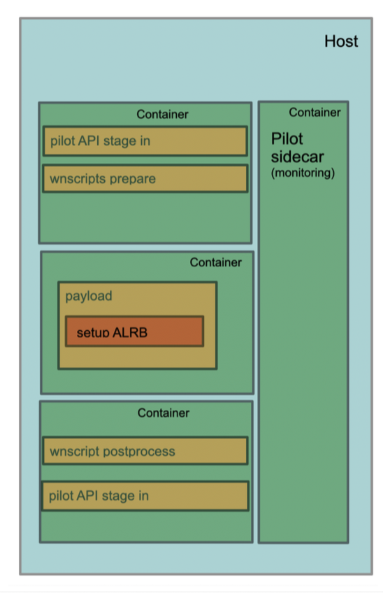

# wfms_prototype



(from slides at [link](https://indico.cern.ch/event/925900/contributions/3890902/attachments/2051032/3437998/container_follow_up.pdf) )

This is a prototype of runninng

* a sequence of containers [stage in, payload, stage out]
* a monitoring container (started before the first container, exiting after payload)

either as
* a standalone script with individual calls to a container runtime
* a pod in kubernetes


### Running without Kubernetes (think setupATLAS -c)

#### steered with Shell (Docker or singularity)
```
#!/bin/sh

datadir="${PWD}/work_$(date '+%s')"
mkdir $datadir

function setupATLAS {
    ddir=$1
    cmap=$2
    image=$3
    if [ ${ALRB_RUNTIME} == "docker" ];then
        docker run --pid=host --rm -v $ddir:/data -v $cmap:/wlcg $image "${@:4}" &
    elif [ ${ALRB_RUNTIME} == 'singularity' ];then
        singularity exec -B $ddir:/data -B $cmap:/wlcg docker://$image  "${@:4}" &
    fi
}

ALRB_RUNTIME="singularity"
setupATLAS $datadir $PWD/configmap lukasheinrich/middlewareimage sh -c 'LOGFILE=/data/step1.log PIDFILE=/data/step1.pid WAITFORFILE=/data/_wlcg_done_0.txt TOMBSTTONEFILE=/data/_wlcg_done_1.txt /wlcg/wrapper.sh /wlcg/step1.sh'
setupATLAS $datadir $PWD/configmap lukasheinrich/payloadimage    sh -c 'LOGFILE=/data/step2.log PIDFILE=/data/step2.pid WAITFORFILE=/data/_wlcg_done_1.txt TOMBSTTONEFILE=/data/_wlcg_done_2.txt /wlcg/wrapper.sh /wlcg/step2.sh'
setupATLAS $datadir $PWD/configmap lukasheinrich/middlewareimage sh -c 'LOGFILE=/data/step3.log PIDFILE=/data/step3.pid WAITFORFILE=/data/_wlcg_done_2.txt TOMBSTTONEFILE=/data/_wlcg_done_3.txt /wlcg/wrapper.sh /wlcg/step3.sh'
setupATLAS $datadir $PWD/configmap lukasheinrich/middlewareimage sh -c '/wlcg/sidecar.sh 2>&1 | tee /data/sidecar.log'

jobs -p > pids.txt
wait < pids.txt
rm pids.txt
```

#### Docker steered w/ Python

```
python python_seq.py jobspec.json
```

```
import multiprocessing
import subprocess
import time
import os
import json
import sys

def call(argv):
    return subprocess.check_call(argv)

spec = json.load(open(sys.argv[1]))
workdir = os.path.abspath('work_'+str(int(time.time())))
cmapdir = os.path.abspath('configmap')
os.makedirs(workdir)

pool = multiprocessing.Pool(processes=4)
pool.map(
    call,
    [
        ['docker','run','--pid=host','--rm','-v',f'{workdir}:/data','-v',f'{cmapdir}:/wlcg', spec['step1']['image'],'sh','-c','LOGFILE=/data/step1.log PIDFILE=/data/step1.pid WAITFORFILE=/data/_wlcg_done_0.txt TOMBSTTONEFILE=/data/_wlcg_done_1.txt /wlcg/wrapper.sh /wlcg/step1.sh'],
        ['docker','run','--pid=host','--rm','-v',f'{workdir}:/data','-v',f'{cmapdir}:/wlcg', spec['step2']['image'],'sh','-c','LOGFILE=/data/step2.log PIDFILE=/data/step2.pid WAITFORFILE=/data/_wlcg_done_1.txt TOMBSTTONEFILE=/data/_wlcg_done_2.txt /wlcg/wrapper.sh /wlcg/step2.sh'],
        ['docker','run','--pid=host','--rm','-v',f'{workdir}:/data','-v',f'{cmapdir}:/wlcg', spec['step3']['image'],'sh','-c','LOGFILE=/data/step3.log PIDFILE=/data/step3.pid WAITFORFILE=/data/_wlcg_done_2.txt TOMBSTTONEFILE=/data/_wlcg_done_3.txt /wlcg/wrapper.sh /wlcg/step3.sh'],
        ['docker','run','--pid=host','--rm','-v',f'{workdir}:/data','-v',f'{cmapdir}:/wlcg', spec['sidecar']['image'],'sh','-c','/wlcg/sidecar.sh 2>&1 | tee /data/sidecar.log'],
    ]
)
pool.close()
pool.join()
```


### Run with Kubernetes

```
python gen_sequence.py
kubectl create configmap wrapper --from-file=configmap -o yaml --dry-run|kubectl replace -f - --force
kubectl replace -f kubeseq.yml --force
```

check logs with

```
kubectl get pods -l job-name=mljob -o name|xargs kubectl logs -c stage1
kubectl get pods -l job-name=mljob -o name|xargs kubectl logs -c stage2
kubectl get pods -l job-name=mljob -o name|xargs kubectl logs -c stage3
kubectl get pods -l job-name=mljob -o name|xargs kubectl logs -c sidecar
```
